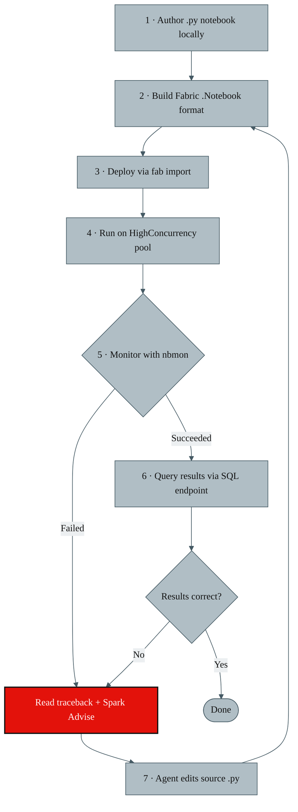

# Fabric Notebook Closed-Loop Development Process

Fabric Notebook Closed-Loop Development Process
An end-to-end process for authoring, deploying, running, monitoring, and correcting PySpark notebooks on Microsoft Fabric — driven entirely from a headless agent environment (SageMaker CodeEditor / devcontainer) with no portal interaction required.

Link to [process document](https://github.com/goreavin/fabric-closed-loop/blob/main/docs/process.md)

## High-Level Closed Loop

## Support

If you find this project useful, consider buying me a coffee! ☕

