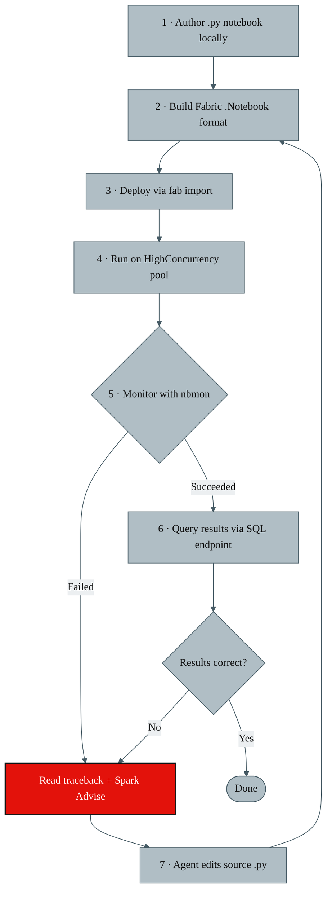
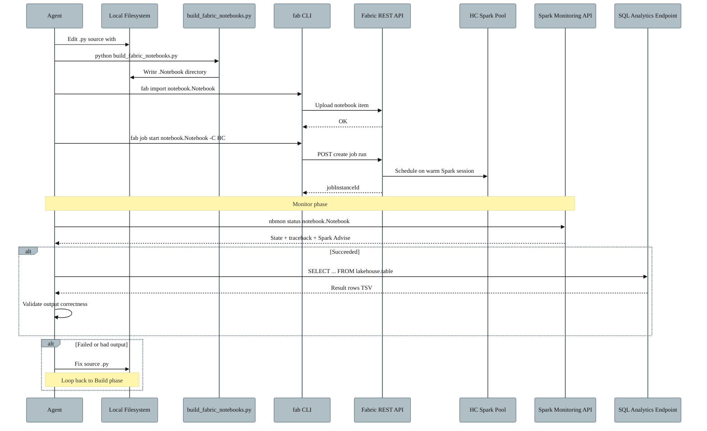
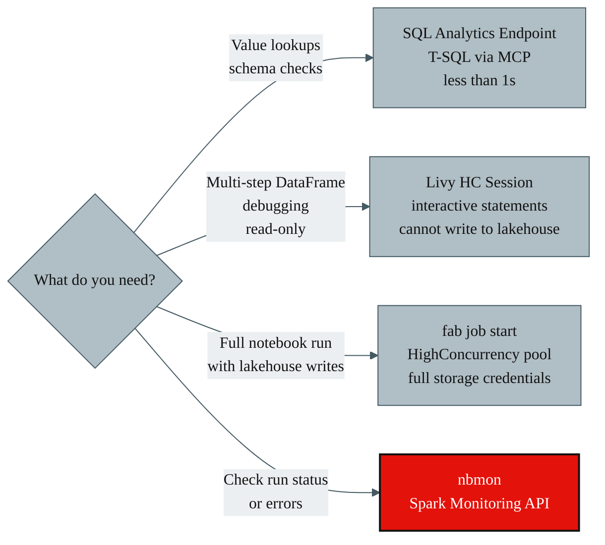

# Fabric Notebook Closed-Loop Development Process

An end-to-end process for authoring, deploying, running, monitoring, and
correcting PySpark notebooks on Microsoft Fabric — driven entirely from a
headless agent environment (SageMaker CodeEditor / devcontainer) with no
portal interaction required.

---

## Table of Contents

1. [Overview](#overview)
2. [Prerequisites & Environment Setup](#prerequisites--environment-setup)
3. [Authentication](#authentication)
4. [PySpark Kernel vs Jupyter Kernel Notebooks](#pyspark-kernel-vs-jupyter-kernel-notebooks)
5. [High-Level Closed Loop](#high-level-closed-loop)
6. [Detailed Sequence of Tool Interactions](#detailed-sequence-of-tool-interactions)
7. [Tool Decision Matrix](#tool-decision-matrix)
8. [Phase-by-Phase Detail](#phase-by-phase-detail)
9. [Notebook Monitor (`nbmon`) Internals](#notebook-monitor-nbmon-internals)
10. [Gotchas & Lessons Learned](#gotchas--lessons-learned)
11. [Quick-Reference Tables](#quick-reference-tables)

---

## Overview

The process implements a **closed-loop development cycle** where an agent:

1. **Authors** PySpark notebooks as plain `.py` files with `# %%` cell markers.
2. **Builds** them into the Fabric `.Notebook` format (cell separators + platform metadata).
3. **Deploys** to the Fabric workspace via the `fab` CLI.
4. **Runs** on a HighConcurrency Spark pool for fast warm-start execution.
5. **Monitors** execution and captures errors via the Spark Monitoring REST API (`nbmon`).
6. **Queries** transformed output tables via a zero-cold-start SQL Analytics endpoint.
7. **Feeds** errors and query results back into the agent, which edits the source `.py`
   file and loops back to step 2.

The loop typically converges in 1–3 iterations. Two auxiliary paths — Livy
interactive statements and the SQL endpoint MCP tool — let the agent inspect
intermediate state without a full notebook round-trip.

---

## Prerequisites & Environment Setup

The closed loop requires several libraries and tools installed in the
development environment. Here's what's needed and how to install each.

### Python libraries

```bash
# MSAL for token acquisition (used by nbmon and SQL endpoint MCP)
pip install msal

# Fabric SQL endpoint access
pip install pymssql        # or: pip install pyodbc (if ODBC driver available)

# HTTP requests (used by nbmon for direct API calls)
pip install requests
```

### CLI tools

```bash
# Fabric CLI — install via pip
pip install fabric-cli
# Or download from: https://learn.microsoft.com/fabric/developer/command-line-tool/fabric-cli-overview

# Verify installation
fab --version
fab auth login
```

### MCP server for SQL Analytics endpoint

The SQL endpoint MCP server is a [FastMCP](https://github.com/jlowin/fastmcp)
stdio server that provides two tools:

- `run_sql(sql, lakehouse, workspace)` — execute read-only T-SQL
- `list_lakehouses(workspace)` — discover available lakehouses

It requires `msal`, `pymssql`, and `fastmcp`. Register it in your agent's MCP
configuration to make the tools available.

### Environment persistence

In ephemeral environments (SageMaker, Codespaces), installations are lost on
restart. Use a bootstrap script that restores:

- Python libraries (via `.pth` wiring or `pip install --target`)
- npm globals (agent tooling, MCP servers)
- CLI wrappers
- Daemon processes (token refresh, keepalive)

---

## Authentication

All tools in the closed loop share a common MSAL token cache. A single
`fab auth login` provisions tokens for every downstream tool.

### Token flow

```
fab auth login
  └─► MSAL device-code flow (interactive, one-time)
      └─► Tokens cached in ~/.config/fab/cache.bin (SerializableTokenCache)
          ├─► fab CLI        — reads token for Fabric REST API
          ├─► nbmon          — reads same token for Spark Monitoring REST API
          ├─► Livy sessions  — reads same token for Livy API calls via fab api
          └─► SQL endpoint   — separate MSAL flow for SQL Analytics
```

### Per-tool authentication details

| Tool | Auth method | Details |
|---|---|---|
| **[`fab` CLI](https://learn.microsoft.com/fabric/developer/command-line-tool/fabric-cli-overview)** | [MSAL device-code](https://learn.microsoft.com/entra/msal/python/getting-started/device-code-flow) via `fab auth login` | Tokens cached in `~/.config/fab/cache.bin` |
| **`nbmon`** | Reads bearer directly from `fab`'s MSAL cache | Same cache file, no separate login |
| **Livy API** (via `fab api`) | Same as `fab` CLI | Calls go through `fab api` wrapper |
| **SQL Analytics endpoint** | Separate [MSAL device-code flow](https://learn.microsoft.com/entra/msal/python/getting-started/device-code-flow) | Scoped to `database.windows.net`; separate cache file |

### Key auth commands

```bash
# Initial login (interactive — prints a device code URL)
fab auth login

# Check token status
fab auth status
# Should show: Logged In: True, with tokens for Fabric, PowerBI, Storage, Azure

# SQL endpoint auth (separate, one-time)
# The MCP server triggers a device-code flow on first use;
# subsequent calls use the cached refresh token silently.
```

### Auth gotchas

- **Livy write limitation**: Livy interactive sessions can **read** lakehouse
  tables, but they **cannot write** to them (Delta MERGE, INSERT, saveAsTable).
  This is why we need to run notebooks via `fab job start` for any code that
  writes to a lakehouse — notebook jobs execute with full storage credentials
  that Livy sessions lack.
- **Token expiry**: Tokens expire after ~1 hour. The `fab` CLI auto-refreshes
  via the cached refresh token. If `nbmon` or Livy calls fail with 401, run
  `fab auth status` (triggers refresh) and retry.
- **Single cache, multiple consumers**: All tools read from the same
  `~/.config/fab/cache.bin`. Never delete it while tools are running.

### References

- [Fabric CLI documentation](https://learn.microsoft.com/fabric/developer/command-line-tool/fabric-cli-overview)
- [MSAL Python — device code flow](https://learn.microsoft.com/entra/msal/python/getting-started/device-code-flow)
- [Fabric REST API authentication](https://learn.microsoft.com/rest/api/fabric/articles/get-started/fabric-api-quickstart)

---

## PySpark Kernel vs Jupyter Kernel Notebooks

Fabric supports two notebook kernel types. The choice fundamentally affects how
code runs, what APIs are available, and how the closed loop operates.

### PySpark kernel (`synapse_pyspark`)

- **This is what we use.** All notebooks in this process target the PySpark kernel.
- Code runs on a **Spark driver** backed by a distributed Spark cluster.
- A pre-initialised `spark` session object (`SparkSession`) is available in every cell.
- DataFrames are **Spark DataFrames** — distributed, lazy, and evaluated via Catalyst.
- Native access to Delta Lake tables in Fabric lakehouses (`spark.table("lakehouse.table")`).
- Cell outputs (via `print()`, `display()`, `df.show()`) are captured in the **driver stdout**.
- `%%sql` magic runs Spark SQL directly.
- Notebook metadata uses `"language_group": "synapse_pyspark"`.
- The `# META` block in each cell specifies `"language": "python"`.

### Jupyter kernel (Python / `synapse_jupyter`)

- Code runs on a **single Python process** (the Jupyter kernel), not a Spark cluster.
- No pre-initialised `spark` object. To use Spark, you must create your own `SparkSession`.
- DataFrames are typically **PyArrow tables** or **Polars DataFrames** (preferred over
  pandas for performance). We use Polars where possible for local DataFrame work.
- You can initialise cores based on workload and use Python-native parallelism
  (`multiprocessing`, `concurrent.futures`, Polars' built-in multithreading) to
  parallelise tasks across available CPU cores — useful for CPU-bound transforms
  that don't need distributed Spark.
- Lakehouse and warehouse table access requires explicit configuration:
  - **Lakehouse tables**: Use the SQL Analytics endpoint via `pymssql` / `pyodbc`
    with MSAL token auth (same mechanism as the MCP `run_sql` tool).
  - **Warehouse tables**: Connect via the warehouse's SQL connection string
    using `pymssql` / `pyodbc` with Azure AD token auth.
  - **OneLake direct**: Read parquet/Delta files directly from `abfss://` paths
    using `pyarrow.parquet` or `deltalake` with appropriate storage credentials.
- Useful for lightweight data science work, plotting, or non-Spark Python tasks.
- Notebook metadata uses `"language_group": "synapse_jupyter"`.

### Why it matters for the closed loop

| Aspect | PySpark kernel | Jupyter kernel |
|---|---|---|
| Cold start | ~2–3 min (Spark session) | ~10 s |
| HighConcurrency pool | ✅ Reuses warm Spark sessions | ❌ Not applicable |
| Lakehouse table access | Native (`spark.table(…)`) | Via SQL endpoint / OneLake direct |
| Parallelism model | Distributed Spark executors | Python multiprocessing / Polars threads |
| Driver log via Monitoring API | ✅ Full stdout/stderr | Limited |
| `nbmon` error extraction | ✅ Spark Advise categories | Python-only tracebacks |
| Delta MERGE / write | Native | Requires `deltalake` library |

The entire closed loop — HighConcurrency pool, `nbmon` monitoring, Spark Advise
categories, Livy interactive sessions — is built around the PySpark kernel.

---

## High-Level Closed Loop



---

## Detailed Sequence of Tool Interactions



---

## Tool Decision Matrix



| Task | Tool | Lakehouse write? | Latency |
|---|---|---|---|
| Value lookups, schema checks, `INFORMATION_SCHEMA` | SQL Analytics endpoint (MCP `run_sql`) | ❌ Read-only | < 1 s |
| Multi-step Spark DataFrame debugging | Livy HC session statements | ❌ Read-only | ~0 s warm / ~2 min cold |
| Full notebook end-to-end run | `fab job start -C HighConcurrency` | ✅ Full write access | ~3 min cold / ~0 min warm |
| Status check on any run | `nbmon status` | n/a | < 5 s |

---

## Phase-by-Phase Detail

### Phase 1 — Author notebooks locally

Notebooks live as plain Python files with `# %%` cell markers:

```
notebooks/
├── nb_01_transform_stage_a.py
├── nb_02_enrich_and_join.py
├── nb_03_write_output.py
└── ...
```

Each `# %%` boundary becomes a separate Spark cell after build. Markdown cells
use `# %% [markdown]` and have lines prefixed with `# `.

**Parameter cells** use a `tags=["parameters"]` annotation in the metadata to
mark them as injectable via `-P` flags at runtime (see the gotcha in Phase 3).

### Phase 2 — Build Fabric notebook format

The build script converts local `.py` files into the Fabric `.Notebook` directory format:

```bash
python bin/build_fabric_notebooks.py
```

**What the build script does:**

```python
#!/usr/bin/env python3
"""
Convert `# %%`-cell .py files into Fabric .Notebook directories
(.platform + notebook-content.py with `# CELL ********************`
separators) so they can be uploaded via `fab import`.
"""
import json, re, uuid
from pathlib import Path

# --- Configuration ---
NOTEBOOKS = [
    ("nb_01_transform_stage_a.py",  "My Notebook 01"),
    ("nb_02_enrich_and_join.py",    "My Notebook 02"),
    # ... add entries for each notebook
]

# Lakehouse attachments — auto-bind on import
DEFAULT_LAKEHOUSE_ID   = "<lakehouse-guid>"
DEFAULT_LAKEHOUSE_NAME = "<lakehouse-name>"
DEFAULT_LAKEHOUSE_WS   = "<workspace-guid>"
KNOWN_LAKEHOUSES = [
    {"id": "<bronze-guid>", "name": "Bronze", "workspace_id": "<workspace-guid>"},
    {"id": "<gold-guid>",   "name": "Gold",   "workspace_id": "<workspace-guid>"},
]

# --- Cell format constants ---
CELL_SEP = "# CELL ********************"
META_BLOCK = (
    "# METADATA ********************\n\n"
    "# META {\n"
    '# META   "language": "python",\n'
    '# META   "language_group": "synapse_pyspark"\n'
    "# META }"
)

def split_cells(src: str):
    """Yield (kind, body) for each # %% cell."""
    # Split on `# %%` markers; `# %% [markdown]` → markdown cells
    ...

def render_notebook(src_path: Path, display_name: str) -> str:
    """Produce Fabric notebook-content.py from a # %%-cell .py file."""
    header = _render_header()  # JSON metadata with lakehouse deps
    cells = []
    for kind, body in split_cells(src_path.read_text()):
        if kind == "code":
            cells.append(f"\n{CELL_SEP}\n\n{body}\n{META_BLOCK}")
    return header + "\n".join(cells) + "\n"

def render_platform(display_name: str) -> str:
    """Produce .platform JSON with display name and logical ID."""
    return json.dumps({
        "$schema": "https://developer.microsoft.com/json-schemas/fabric/gitIntegration/platformProperties/2.0.0/schema.json",
        "metadata": {"type": "Notebook", "displayName": display_name},
        "config": {"version": "2.0", "logicalId": str(uuid.uuid4())},
    }, indent=2)

def main():
    for src_name, display in NOTEBOOKS:
        nb_dir = Path(f"fabric_notebooks/{display}.Notebook")
        nb_dir.mkdir(parents=True, exist_ok=True)
        (nb_dir / "notebook-content.py").write_text(
            render_notebook(Path(f"notebooks/{src_name}"), display))
        (nb_dir / ".platform").write_text(render_platform(display))
        print(f"wrote {nb_dir}")
```

**Output structure:**

```
fabric_notebooks/
└── My Notebook 01.Notebook/
    ├── .platform              # JSON: displayName, type, logicalId
    └── notebook-content.py    # Fabric cell format with # CELL separators
```

The build script pre-configures lakehouse attachments (default + known) so
notebooks auto-bind to the correct lakehouses on import — no manual UI step.

### Phase 3 — Deploy to Fabric workspace

```bash
fab import "fabric_notebooks/My Notebook 01.Notebook"
```

The [`fab` CLI](https://learn.microsoft.com/fabric/developer/command-line-tool/fabric-cli-overview)
uploads the notebook item to the target Fabric workspace.

**References:**
- [Fabric CLI overview](https://learn.microsoft.com/fabric/developer/command-line-tool/fabric-cli-overview)
- [Fabric CLI — import command](https://learn.microsoft.com/fabric/developer/command-line-tool/fabric-cli-reference#import)

### Phase 4 — Run the notebook

**Standard run on HighConcurrency pool:**

```bash
fab job start \
  "MyWorkspace.Workspace/My Notebook 01.Notebook" \
  -C '{"sparkPool":{"type":"HighConcurrency"}}' \
  -P "PARAM1:string=value1,PARAM2:int=42,PARAM3:bool=true"
```

| Flag | Purpose |
|---|---|
| `-C '{"sparkPool":{"type":"HighConcurrency"}}'` | Reuse a warm Spark session across runs |
| `-P "KEY:type=value,..."` | Override parameter-cell variables (types: `string`, `int`, `float`, `bool`) |

Returns a `jobInstanceId` immediately (asynchronous). The HighConcurrency pool
reuses warm Spark sessions — first run incurs ~3 min startup; subsequent runs
within ~20 min start near-instantly.

**Why `fab job start` and not Livy?** Notebook jobs started via `fab job start`
execute with **full storage credentials**, meaning they can write to lakehouse
tables (Delta MERGE, INSERT, saveAsTable). Livy interactive sessions can read
tables but **cannot write** — they lack the storage scope token.

**Alternative — `nbmon submit`** wraps `fab job start` with HighConcurrency
and auto-attaches to live-stream driver logs:

```bash
nbmon submit "MyWorkspace.Workspace/My Notebook 01.Notebook"
```

**References:**
- [Fabric CLI — job start](https://learn.microsoft.com/fabric/developer/command-line-tool/fabric-cli-reference#job)
- [HighConcurrency mode](https://learn.microsoft.com/fabric/data-engineering/high-concurrency-mode)

### Phase 5 — Monitor execution / detect errors

```bash
nbmon status "MyWorkspace.Workspace/My Notebook 01.Notebook" --run latest
```

Prints a compact 7-line rich banner (see [nbmon Internals](#notebook-monitor-nbmon-internals)
for how this works under the hood):

```
── Failed (21s) ── My Notebook 01
livy=<livy-guid>  app=application_<id>
error: (Cell In[17], line 5)
  AnalysisException: [PATH_NOT_FOUND] Path does not exist: abfss://…/Files/config/file.csv
spark_advise: Spark_User_SQL_PathDoesNotExist
  Given file path does not exist in the user storage…
```

| Banner line | Content |
|---|---|
| 1 | State (`Running` / `Succeeded` / `Failed`) + wall-clock duration |
| 2 | Notebook display name |
| 3 | Livy session ID + Spark application ID |
| 4 | Last cell stdout prints |
| 5–6 | Python traceback with `Cell In[N], line M` anchor + failing path |
| 7 | Spark Advise category |

> **Never use `fab job run-status`** for status checks — it only prints
> `"Job instance failed without detail error"` on failure.

### Phase 6 — Query results via SQL Analytics endpoint

Use the MCP tool to run read-only T-SQL against any lakehouse:

```sql
-- Example: check output of a notebook run
SELECT TOP 10 *
FROM dbo.my_output_table
WHERE column_a = 'filter_value'
ORDER BY column_b
```

**Capabilities:**

- **Zero cold-start** (< 1 s response vs Livy's 60–120 s).
- **Bypasses the Livy write-scope limitation** — SQL endpoint runs server-side
  inside Fabric and reads OneLake directly.
- Supports `INFORMATION_SCHEMA`, `sys.columns`, DMVs for schema exploration.
- 200-row / ~16 KB cap per query.
- Discover available lakehouses via `list_lakehouses(workspace="…")`.
- Can query any lakehouse by display name (no GUIDs needed in the call).

**References:**
- [Lakehouse SQL Analytics endpoint](https://learn.microsoft.com/fabric/data-engineering/lakehouse-sql-analytics-endpoint)
- [T-SQL syntax for lakehouse](https://learn.microsoft.com/fabric/data-warehouse/tsql-surface-area)

### Phase 7 — Feed results back → corrections (the closed loop)

1. Agent reads the `nbmon` error banner (traceback + Spark Advise category).
2. Agent queries transformed data via SQL endpoint to verify partial output or
   inspect schema.
3. Agent edits the local `.py` source file to fix the issue.
4. **Loop back to Phase 2** (rebuild) → **Phase 3** (redeploy) → **Phase 4** (rerun).

The loop continues until `nbmon` reports `Succeeded` **and** the SQL endpoint
query confirms correct output.

### Alternative Path — Livy Interactive Statements

For multi-step Spark DataFrame debugging without a full notebook round-trip,
use the [Livy API](https://learn.microsoft.com/fabric/data-engineering/lakehouse-notebook-livy-api)
to submit individual statements to a warm Spark session.

> **Important limitation:** Livy sessions can **read** lakehouse tables but
> **cannot write** to them. Use Livy for interactive exploration and debugging;
> use `fab job start` for any code that needs to persist results.

```bash
# Create or reuse a HighConcurrency Livy session
POST workspaces/<workspace-guid>/lakehouses/<lakehouse-guid>/livyapi/versions/2023-12-01/highConcurrencySessions
Body: {"sessionTag": "my-session-tag"}

# Submit a statement
POST …/highConcurrencySessions/<session-id>/repls/<repl-id>/statements
Body: {"code": "df = spark.table('my_table'); df.show()", "kind": "pyspark"}

# Poll for result
GET …/highConcurrencySessions/<session-id>/repls/<repl-id>/statements/<stmt-id>
```

HC Livy packs multiple REPLs onto one underlying Spark session via a
`sessionTag`. Only the first acquire pays cold-start; subsequent REPLs with the
same tag join instantly.

**References:**
- [Livy API for Fabric](https://learn.microsoft.com/fabric/data-engineering/lakehouse-notebook-livy-api)
- [High concurrency Livy sessions](https://learn.microsoft.com/fabric/data-engineering/high-concurrency-livy)

---

## Notebook Monitor (`nbmon`) Internals

`nbmon` is a custom Python CLI that bridges the gap between `fab job start`
(which provides no error detail on failure) and the Fabric Spark Monitoring REST
API (which has the actual driver logs).

> **Note:** `nbmon` was built by an AI coding agent once the closed-loop process
> described in this document was finalised. The specification below — the
> Spark Monitoring REST API endpoints, the error extraction logic, the banner
> format — is the complete design. You can hand this write-up to your own
> coding agent and have it build an equivalent tool from scratch.

### What `nbmon` does internally

```
nbmon status "MyWorkspace.Workspace/notebook.Notebook" --run latest
```

**Step 1 — Resolve the notebook item ID.**
Calls `fab get "<workspace-path>" -q id` to translate the human-readable
workspace path into a Fabric item UUID.

**Step 2 — Acquire a bearer token.**
Reads `~/.config/fab/cache.bin` using Python's `msal.SerializableTokenCache`.
Finds the access token scoped to `api.fabric.microsoft.com`. If the token is
near expiry (< 60 s), triggers a refresh via `fab auth status` and re-reads.

**Step 3 — List recent runs.**
Calls the Spark Monitoring REST API:

```
GET https://api.fabric.microsoft.com/v1/workspaces/<workspace-guid>/notebooks/<item-guid>/livySessions
```

Returns a JSON array of all Livy sessions for this notebook, each with:
`livyId`, `sparkApplicationId`, `jobInstanceId`, `state`, `submittedDateTime`,
`startTimeUtc`, `endTimeUtc`.

**Step 4 — Select the target run.**
- `--run latest` → sort by `submittedDateTime` descending, pick `[0]`.
- `--run livy:<uuid>` → filter by `livyId`.
- `--run jobInstance:<uuid>` → filter by `jobInstanceId`.

**Step 5 — Fetch driver stderr.**
Calls the log endpoint directly via `requests` (not `fab api`, which cannot
return raw `text/plain` — it unconditionally `json.loads()` the response):

```
GET https://api.fabric.microsoft.com/v1/workspaces/<workspace-guid>/notebooks/<item-guid>/livySessions/<livy-id>/applications/<app-id>/logs
    ?type=driver&fileName=stderr&isDownload=true
Headers: Authorization: Bearer <token>
```

Returns the full driver stderr as `text/plain` (can be 400–800 KB for a
completed run).

**Step 6 — Extract the error.**
Parses the stderr blob to find:
- The Python traceback (regex for `Cell In[N], line M` anchors).
- The Spark Advise category (regex for `_name -> Spark_*` patterns — Fabric's
  error classification system).
- The last N lines of cell stdout output.

**Step 7 — Render the banner.**
Formats the 7-line summary with colour codes (if TTY) and prints to stdout.

### Example output for each command

**`nbmon status` — Failed run (most common debugging case):**

```
── Failed (21s) ── My Transform Notebook
livy=<livy-guid>  app=application_<id>  cell=17
last output:
  Processing batch XXXX... 847 rows
error: (Cell In[17], line 5)
  AnalysisException: [PATH_NOT_FOUND] Path does not exist: abfss://<container>@<account>.dfs.fabric.microsoft.com/Files/config/missing_file.csv
spark_advise: Spark_User_SQL_PathDoesNotExist
  Given file path does not exist in the user storage…
```

**`nbmon status` — Succeeded run:**

```
── Succeeded (109s) ── My Transform Notebook
livy=<livy-guid>  app=application_<id>  cell=24
last output:
  Wrote 12,847 rows to my_output_table
  MERGE complete: 312 inserts, 48 updates, 0 deletes
```

**`nbmon status` — Running (in-flight, no error yet):**

```
── Running (43s) ── My Transform Notebook
livy=<livy-guid>  app=application_<id>  cell=9
last output:
  Loading dimension tables...
  Joined 3 sources, 24,601 rows
```

**`nbmon status` — Failed with no Python traceback (rare — OOM / driver kill):**

```
── Failed (312s) ── My Heavy Notebook
livy=<livy-guid>  app=application_<id>
(no python traceback in stdout — for full driver log: nbmon attach <path> --run livy:<livy-guid> --once)
spark_advise: Spark_Internal_OutOfMemory
  The Spark driver or executor ran out of memory…
```

**`nbmon list` — Recent runs:**

```
  # │ State      │ Duration │ Livy ID        │ App ID                  │ Submitted
────┼────────────┼──────────┼────────────────┼─────────────────────────┼──────────────────
  1 │ Succeeded  │ 109s     │ <livy-guid-1>  │ application_<id_1>      │ 2026-04-30 14:22
  2 │ Failed     │ 21s      │ <livy-guid-2>  │ application_<id_2>      │ 2026-04-30 14:18
  3 │ Succeeded  │ 94s      │ <livy-guid-3>  │ application_<id_3>      │ 2026-04-30 13:55
```

**`nbmon submit` — Live-streamed output (abbreviated):**

```
[submit] fab job start "MyWorkspace.Workspace/My Notebook.Notebook" -C HighConcurrency
[submit] jobInstanceId: <job-guid>
[submit] Waiting for Spark session...
[OUT] Spark session available as 'spark'.
[OUT] Loading config from abfss://...
[OUT] Processing batch XXXX... 847 rows
[ERR] 26/04/30 14:22:31 WARN TaskSetManager: Lost task 0.0 in stage 12.0
[OUT] Wrote 12,847 rows to my_output_table
── Succeeded (109s) ── My Notebook
```

### Why not just use `fab job run-status`?

`fab job run-status` wraps the Fabric Jobs REST API, which only returns a
high-level status envelope. On failure it prints:

```
failureReason: {"errorCode":"JobInstanceStatusFailed","message":"Job instance failed without detail error"}
```

No traceback, no cell reference, no Spark error category. This is useless for
debugging. The Spark Monitoring API (what `nbmon` uses) has the actual driver
logs — the same logs you'd see in the Fabric portal's Monitor Hub.

### Spark Monitoring REST API surface used by `nbmon`

All endpoints are under `https://api.fabric.microsoft.com/v1/`:

| Purpose | Method | Path |
|---|---|---|
| List runs | GET | `workspaces/<ws>/notebooks/<item>/livySessions` |
| Run detail | GET | `workspaces/<ws>/notebooks/<item>/livySessions/<livy-id>` |
| Log metadata | GET | `…/livySessions/<livy-id>/applications/<app-id>/logs?type=driver&meta=true&fileName=stderr` |
| Log content | GET | `…/livySessions/<livy-id>/applications/<app-id>/logs?type=driver&fileName=stderr&isDownload=true` |
| Byte-range read | GET | `…&isPartial=true&offset=<N>&size=<M>` (appended to log content URL) |

Required token scope: `Notebook.Read.All` (included in the standard `fab auth login` token).

**References:**
- [Spark monitoring API overview](https://learn.microsoft.com/fabric/data-engineering/spark-monitoring-api-overview)
- [Notebook Livy sessions REST API](https://learn.microsoft.com/rest/api/fabric/notebook/livy-sessions/get-livy-session)

### `nbmon` commands

| Command | Purpose |
|---|---|
| `nbmon status <path> [--run latest]` | Print the 7-line error/status banner |
| `nbmon list <path> [--limit N]` | List recent runs with state + livy + app IDs |
| `nbmon attach <path> [--run …] [--once]` | Full driver log dump (800 KB+, for terminal use) |
| `nbmon submit <path>` | `fab job start -C HC` + live-stream driver log |

---

## Gotchas & Lessons Learned

| # | Gotcha | Detail |
|---|---|---|
| 1 | **`fab import` strips `tags` metadata** | `fab import --format .py` silently removes `"tags"` from cell metadata, breaking parameter cells (`tags=["parameters"]`). **Workarounds:** designate the parameter cell in the Fabric UI first, use git integration, or use a direct REST PUT of the notebook definition. |
| 2 | **Never use `fab job run-status` for debugging** | It only prints `"Job instance failed without detail error"` on failure. Always use `nbmon` instead — it surfaces the actual Python traceback and Spark Advise error category from the driver logs. |
| 3 | **Livy can read but cannot write** | Livy interactive sessions can read lakehouse tables but cannot write (MERGE, INSERT, saveAsTable). Any notebook that writes to a lakehouse must run via `fab job start`, which executes with full storage credentials. |
| 4 | **HighConcurrency cold start** | First run on an HC pool takes ~3 min for Spark session creation. Subsequent runs within ~20 min of idle are near-instant. Plan iteration speed accordingly. |
| 5 | **Driver log size** | Full `stderr` logs can be ~800 KB. Never pipe them into an agent's conversation context. Use `nbmon attach … --once` from a real terminal for full inspection. The 7-line `nbmon status` banner is sufficient for ~95% of failures. |
| 6 | **SQL endpoint row cap** | The SQL Analytics endpoint returns at most 200 rows / ~16 KB per query. Use `TOP N`, `WHERE`, or aggregations to stay within limits. |
| 7 | **Shared MSAL token cache** | All tools (`fab`, `nbmon`, Livy) read from the same MSAL cache. If one tool gets a 401, run `fab auth status` to refresh — all tools benefit immediately. |
| 8 | **`fab api` cannot return raw text** | `fab api` unconditionally `json.loads()` every response. Endpoints that return `text/plain` (like driver logs) fail with `Expecting value: line 1 column 1`. This is why `nbmon` uses `requests` directly with the extracted bearer token instead of `fab api`. |

---

## Quick-Reference Tables

### Tools and endpoints

| Tool / Endpoint | Purpose | Example invocation |
|---|---|---|
| `fab` CLI | Import notebooks, start jobs, auth | `fab import "notebook.Notebook"` |
| `fab job start` | Run notebook with write access | `fab job start "path.Notebook" -C '{"sparkPool":{"type":"HighConcurrency"}}'` |
| `fab auth login` | Provision MSAL tokens | `fab auth login` |
| `nbmon status` | Monitor run status + errors | `nbmon status "path.Notebook" --run latest` |
| `nbmon submit` | Run + monitor in one command | `nbmon submit "path.Notebook"` |
| `nbmon list` | List recent runs | `nbmon list "path.Notebook" --limit 10` |
| SQL endpoint (MCP) | T-SQL queries against lakehouses | `run_sql(sql="SELECT …", lakehouse="MyLakehouse")` |
| SQL endpoint (MCP) | Discover lakehouses | `list_lakehouses(workspace="My Workspace")` |
| Livy HC sessions | Interactive Spark statements (read-only) | `POST …/highConcurrencySessions` + statements |
| `build_fabric_notebooks.py` | Convert `.py` → `.Notebook` | `python bin/build_fabric_notebooks.py` |

### Fabric REST API endpoints used

| Purpose | Method | Endpoint path |
|---|---|---|
| Upload notebook | POST | `workspaces/<ws>/items` (via `fab import`) |
| Start notebook job | POST | `workspaces/<ws>/items/<item>/jobs/instances` (via `fab job start`) |
| List Livy sessions | GET | `workspaces/<ws>/notebooks/<item>/livySessions` |
| Get Livy session | GET | `workspaces/<ws>/notebooks/<item>/livySessions/<livy-id>` |
| Get driver log | GET | `…/livySessions/<livy-id>/applications/<app-id>/logs?type=driver&fileName=stderr&isDownload=true` |
| Create HC Livy session | POST | `workspaces/<ws>/lakehouses/<lh>/livyapi/versions/2023-12-01/highConcurrencySessions` |
| Submit Livy statement | POST | `…/highConcurrencySessions/<session-id>/repls/<repl-id>/statements` |
| SQL Analytics endpoint | TDS | `<lakehouse-sql-endpoint-host>:1433` (via `pymssql` / `pyodbc`) |

### External references

| Topic | URL |
|---|---|
| Fabric CLI overview | <https://learn.microsoft.com/fabric/developer/command-line-tool/fabric-cli-overview> |
| Fabric CLI reference | <https://learn.microsoft.com/fabric/developer/command-line-tool/fabric-cli-reference> |
| HighConcurrency mode | <https://learn.microsoft.com/fabric/data-engineering/high-concurrency-mode> |
| Livy API for Fabric | <https://learn.microsoft.com/fabric/data-engineering/lakehouse-notebook-livy-api> |
| HC Livy sessions | <https://learn.microsoft.com/fabric/data-engineering/high-concurrency-livy> |
| Spark Monitoring API | <https://learn.microsoft.com/fabric/data-engineering/spark-monitoring-api-overview> |
| Lakehouse SQL endpoint | <https://learn.microsoft.com/fabric/data-engineering/lakehouse-sql-analytics-endpoint> |
| Fabric REST API auth | <https://learn.microsoft.com/rest/api/fabric/articles/get-started/fabric-api-quickstart> |
| MSAL Python docs | <https://learn.microsoft.com/entra/msal/python/getting-started/device-code-flow> |
| Notebook Livy REST spec | <https://learn.microsoft.com/rest/api/fabric/notebook/livy-sessions/get-livy-session> |
